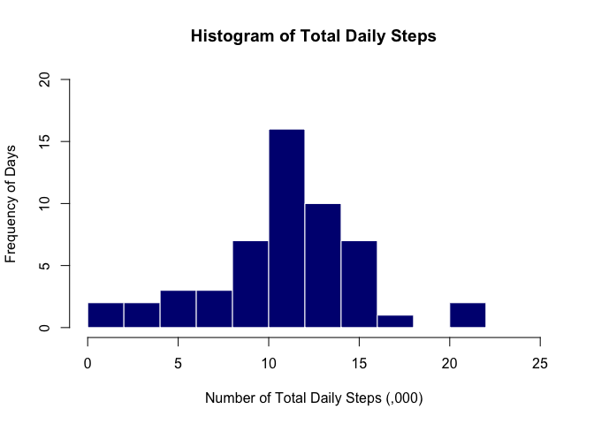
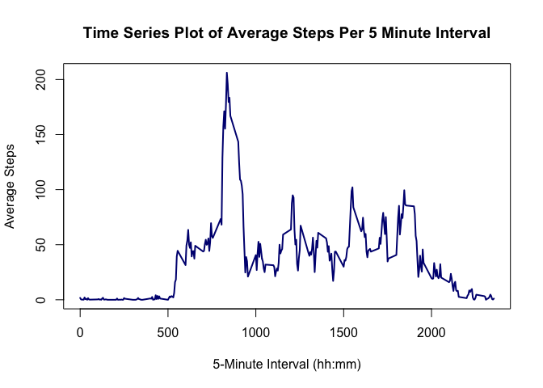
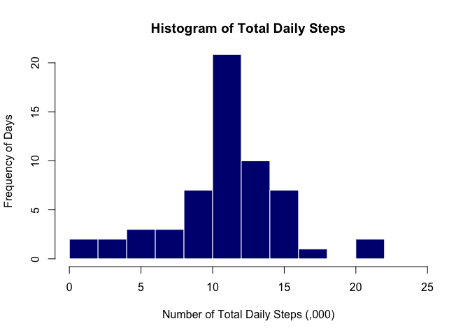
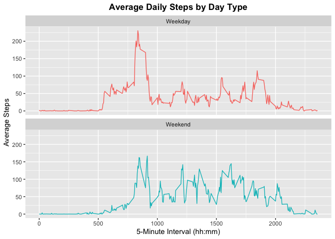

## Introduction

This R Markdown file was created in accordance with the guidelines for the Reproducible Research course, Project 1. I will be answering five questions relating to fitbit activity data.  

### Loading and Pre-processing The Data

Before beginning it is worth noting I have made use of the following packages; dplyr, formattable, and tidyverse.


```r
activity.df <- as_tibble(read.csv("activity.csv"))
print(head(activity.df))
```

```
## # A tibble: 6 × 3
##   steps date       interval
##   <int> <chr>         <int>
## 1    NA 2012-10-01        0
## 2    NA 2012-10-01        5
## 3    NA 2012-10-01       10
## 4    NA 2012-10-01       15
## 5    NA 2012-10-01       20
## 6    NA 2012-10-01       25
```

We can see from the resultant snapshot of the dataframe that the data has loaded correctly and been processed as tibble using the dplyr package. The dimensions are confirmed and the contents appear sensible despite the already state NA's.

Now I will address each questions and their sub-questions.

### What is the mean total number of steps taken per day?

#### 1. Calculate the total number of steps taken per day
#### 2. Make a histogram of the total number of steps taken each day
#### 3. Calculate and report the mean and median of the total number of steps taken per day

To answer these, I will need to manipulate the data frame then construct a chart from the result


```r
Total.Steps <-  activity.df %>%
                group_by(date) %>%
                summarise(steps = sum(steps), n=n())
```


```r
plot1 <- hist(Total.Steps$steps / 1000, 
              breaks = 12, 
              xlab = "Number of Total Daily Steps (,000)",
              ylab = "Frequency of Days",
              xlim = c(0, 25),
              ylim = c(0, 20), 
              col = "navy",
              border = "white",
              main = "Histogram of Total Daily Steps")
```

<!-- -->

The histogram below answers Q1 and Q2. To answer Q3 I will simply show the summary table.


```r
print(summary(Total.Steps))
```

```
##      date               steps             n      
##  Length:61          Min.   :   41   Min.   :288  
##  Class :character   1st Qu.: 8841   1st Qu.:288  
##  Mode  :character   Median :10765   Median :288  
##                     Mean   :10766   Mean   :288  
##                     3rd Qu.:13294   3rd Qu.:288  
##                     Max.   :21194   Max.   :288  
##                     NA's   :8
```

From the table we can see the reported mean and median are 10,766 and 10,765 respectively (note that NA's are ignored for these questions)

Moving onto the next question.

### What is the average daily activity pattern?
#### 1. Make a time series plot (i.e. type = "l") of the 5-minute interval (x-axis) and the average number of steps taken, averaged across all days (y-axis)?
#### 2. Which 5-minute interval, on average across all the days in the dataset, contains the maximum number of steps?

To address these questions I will need to again manipulate the data and then build a plot from the resulting output. 


```r
interval_mean <- activity.df %>% 
                 group_by(interval) %>%
                 summarise(interval_average = mean(steps, na.rm = TRUE), n = n())
```


```r
plot2 <- plot(interval_mean$interval, interval_mean$interval_average, type = "l",
              main = "Time Series Plot of Average Steps Per 5 Minute Interval",
              xlab = "5-Minute Interval (hh:mm)",
              ylab = "Average Steps",
              col = "navy",
              lwd = 2)
```

<!-- -->

The chart above addresses Q2. The following extract from the manipulated table addresses Q1

```r
max <- interval_mean %>% slice_max(interval_average)
print(max)
```

```
## # A tibble: 1 × 3
##   interval interval_average     n
##      <int>            <dbl> <int>
## 1      835             206.    61
```

We can see from this that the time interval with the most steps on average across all the days was 08:35am

Now onto the next question.

### Imputing Missing Values
#### 1. Calculate and report the total number of missing values in the dataset (i.e. the total number of rows with NAs)
#### 2. Devise a strategy for filling in all of the missing values in the dataset. The strategy does not need to be sophisticated. For example, you could use the mean/median for that day, or the mean for that 5-minute interval, etc.
#### 3. Create a new dataset that is equal to the original dataset but with the missing data filled in.
#### 4. Make a histogram of the total number of steps taken each day and Calculate and report the mean and median total number of steps taken per day. Do these values differ from the estimates from the first part of the assignment? What is the impact of imputing missing data on the estimates of the total daily number of steps?

Firstly, I'll calculate missing values using the following code


```r
NAs <- sum(is.na.data.frame(activity.df))
print(NAs)
```

```
## [1] 2304
```

We can see the total number of NA's equals 2,304.

To 'fix' this dataset, I have come up with the very simple idea to use the daily average for any given time interval to replace where any NAs. To do this I will need to use a loop function which loops through all the rows, and wherever [i, 3] == TRUE for NA then the function will go about replacing the value with the average which has already been calculated in the previous question. The code is as follows...


```r
activity.df$steps <- as.double(activity.df$steps)
fixed.df <- activity.df
                for(x in 1:17568) {
                        as.double(fixed.df$steps)
                        if(is.na(fixed.df[x,1]) == TRUE) {
                                fixed.df[x,1] <- interval_mean[interval_mean$interval %in% fixed.df[x,3], 2]
                                                          }
                                  }
print(head(fixed.df))
```

```
## # A tibble: 6 × 3
##    steps date       interval
##    <dbl> <chr>         <int>
## 1 1.72   2012-10-01        0
## 2 0.340  2012-10-01        5
## 3 0.132  2012-10-01       10
## 4 0.151  2012-10-01       15
## 5 0.0755 2012-10-01       20
## 6 2.09   2012-10-01       25
```

From the head of the fixed table we can already see that the NAs that were previously present in 'activity.df' are no longer present in 'fixed.df'

Now I will plot an updated histogram, following similar logic to the earlier question. First manipulating the df then plotting using base R.


```r
Total.Steps2 <-  fixed.df %>%
        group_by(date) %>%
        summarise(steps = sum(steps), n=n())
```


```r
plot3 <- hist(Total.Steps2$steps / 1000, 
              breaks = 12, 
              xlab = "Number of Total Daily Steps (,000)",
              ylab = "Frequency of Days",
              xlim = c(0, 25),
              ylim = c(0, 20), 
              col = "navy",
              border = "white",
              main = "Histogram of Total Daily Steps")
```

<!-- -->


```r
print(summary(Total.Steps2))
```

```
##      date               steps             n      
##  Length:61          Min.   :   41   Min.   :288  
##  Class :character   1st Qu.: 9819   1st Qu.:288  
##  Mode  :character   Median :10766   Median :288  
##                     Mean   :10766   Mean   :288  
##                     3rd Qu.:12811   3rd Qu.:288  
##                     Max.   :21194   Max.   :288
```

Despite imputing the NAs, we struggle to see any material change in the resulting histogram. Additionally we can see from the summary table that there is an ever so slight increase in the median. 

Now for the final question.

### Are there differences in activity patterns between weekdays and weekends?
#### 1. Create a new factor variable in the dataset with two levels – “weekday” and “weekend” indicating whether a given date is a weekday or weekend day.
#### 2. Make a panel plot containing a time series plot (i.e. type = "l") of the 5-minute interval (x-axis) and the average number of steps taken, averaged across all weekday days or weekend days (y-axis). See the README file in the GitHub repository to see an example of what this plot should look like using simulated data.

To answer the first question I created two vectors populated with the names of weekdays and the names of weekend days. Then I set the date variable to be a date type rather than character, this enabled me to easily assign day names to the raw dates using the lubridate package's weekday() function. Lastly, I mutated the table to create additional columns based on certain conditions using 'case_when()' function. The code are as follows.


```r
weekday <- c("Monday", "Tuesday", "Wednesday", "Thursday", "Friday")
weekend <- c("Saturday", "Sunday")
fixed.df$date <- as.Date(fixed.df$date)
week.df <- fixed.df %>% mutate(Day = weekdays(date)) %>%
           mutate(DayType = case_when(Day %in% weekday ~ "Weekday", Day %in% weekend ~ "Weekend")) %>%
           select(-c(Day))
           
print(head(week.df))
```

```
## # A tibble: 6 × 4
##    steps date       interval DayType
##    <dbl> <date>        <int> <chr>  
## 1 1.72   2012-10-01        0 Weekday
## 2 0.340  2012-10-01        5 Weekday
## 3 0.132  2012-10-01       10 Weekday
## 4 0.151  2012-10-01       15 Weekday
## 5 0.0755 2012-10-01       20 Weekday
## 6 2.09   2012-10-01       25 Weekday
```

From the head of week.df we can see that the variable DayType has been created, with the levels of either weekday or weekend.

Now I will construct two time series plots which will allow us to look at the average number of steps across days by time intervals, but split by DayType.


```r
week.summ <- week.df %>% group_by(interval, DayType) %>%
                summarise(interval_average = mean(steps, na.rm = TRUE), n = n())
plot4 <- ggplot(week.summ, aes(x = interval, y= interval_average, col = DayType)) +
                geom_line() +
                facet_wrap(~ DayType, ncol = 1, nrow = 2) +
                ggtitle("Average Daily Steps by Day Type") +
                xlab("5-Minute Interval (hh:mm)") +
                ylab("Average Steps") +
                theme(legend.position = "none", plot.title = element_text(hjust = 0.5, face = "bold"))

print(plot4)
```

<!-- -->

We can see from these two charts that step activity begins slightly later on weekends than it does on weekdays, which makes sense as weekdays are days people tend to get up early to go to work.

End.


